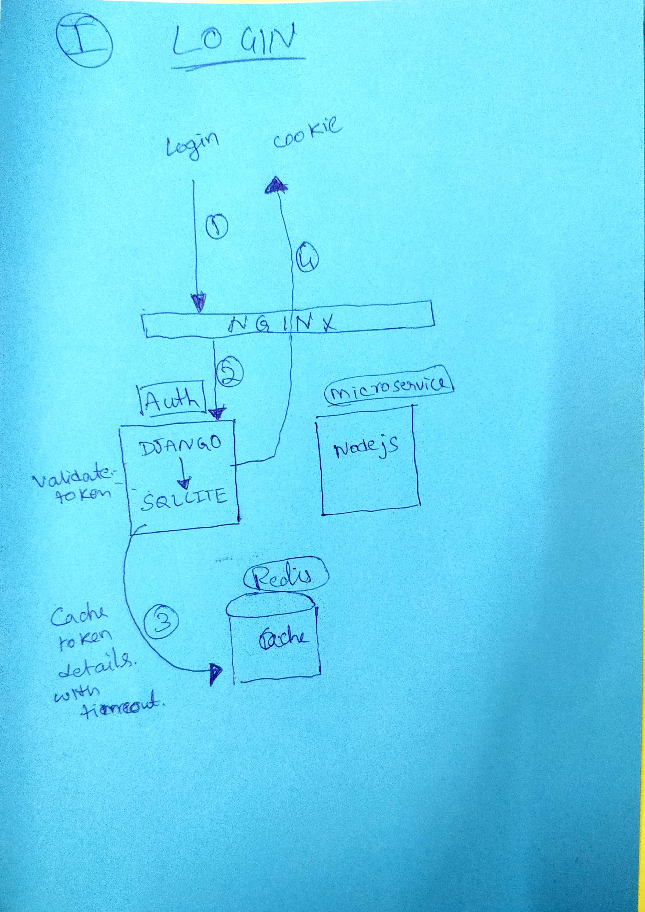
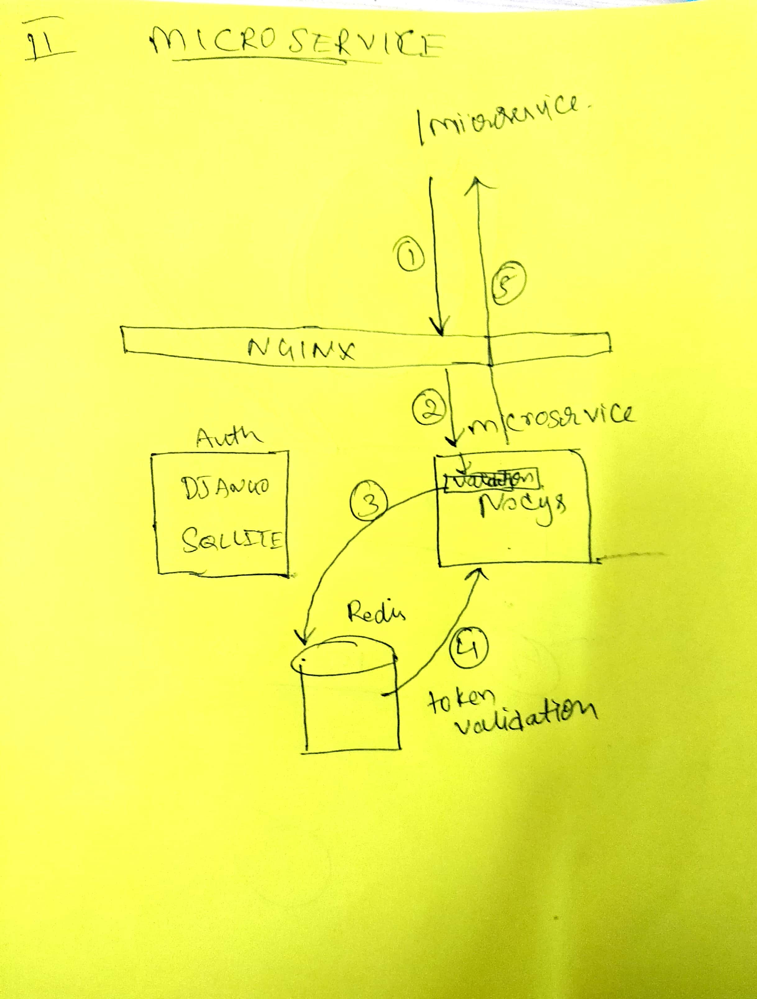
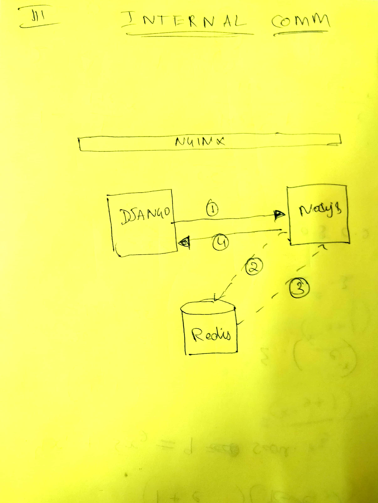

# Propeller Aero solutions

## Architecture diagram

## Assumptions 
1. Optimize and redesign auth part of the application
2. Solve the problem of login throughout the domain (**.lcl.host is considered as the domain for the application)
3. Microservices talk to each other internally using service layers (either docker compose or kubernetes services)
4. All forms of authentication follow either cookies (for browsers) or headers (SSO/OAuth) based approach
5. Reverse proxy is the only way for external sources to interact with containers. (Containers are not exposed without nginx)
6. Optimise communications between containers and allow for async or cron jobs between containers
7. All requests are HTTP only. So I have have not used certificates anywhere
8. Not to make too many changes in UI

## Working Solution
1. Go to your preferred workspace 
2. RUN following commands 
    * git clone https://github.com/gauti038/properller-aero-challenge.git
    * cd properller-aero-challenge
    * docker-compose up --build
    * Clear your browser cookies --> Very important
3. Open http://random.lcl.host:5000/ on chrome and enter --> root / password123 
4. You can try other subdomains without having to login everytime
4. Copy the authtoken 
5. From another terminal run - 
    * curl -w '\n' http://asdf.lcl.host:5000/microservice 
    * You will see - "please pass either sessionid cookie or authtoken header"
    * Nginx is responding with this error without even calling microservice, saving load on microservice
6. From another terminal
    * curl -w '\n' http://localhost:5000/microservice -H 'authtoken:`paste the auth token copied`'
    * Hello World!. Your authtoken is ^some token^
    * This response is from microservice after validating the token with redis cache (NOT auth system)
    * Also the token in redis expires at the same time as browser cookie. So no need to worry too much about data synchronization
    * This approach can be used by async or cronJobs to communicate with microservice from outside the environment
7. For internal communications between containers 
    * In kubernetes environment we can use service mesh like Istio, which handles most concerns
    * To demonstrate it here - assumed that services are directly speaking over services instead of global load balancer or reverse-proxy
    * Run curl from inside the auth container to microservice directly
    * docker exec -it $(docker ps | grep auth| awk '{print $1}') sh -c "apk add curl"
    * docker exec -it $(docker ps | grep auth| awk '{print $1}') sh -c "curl -v -w '\n' http://microservice:3000/  -H 'authtoken:`paste the auth token`'"
    * if you face any issues --> replace the data within () with valid auth docker container id - 
    * docker exec -it ^auth container ID^ sh -c "curl -w '\n' http://microservice:3000/ -H 'authtoken:`paste the token`'"
    * The same approach can be used for all other internal communications.

## Solution Flow

### login 
1. First time user opens http://domain.lcl.host:5000/ , gets to login page
2. After entering username and password --> nginx redirects --> auth 
3. Auth validates and responds with cookies
4. nginx returns this response and adds a domain name for cookie as .lcl.host
5. The Browser reuses the same cookie across the domain of .lcl.host 
5. Can try other subdomains - http://asdf.lcl.host:5000/ or http://propeller.lcl.host:5000/ without having to enter the login details everytime

### microservice 
1. There are 2 ways to access microservice - 1. Browser , 2. REST API 
2. For Browser - 
    * browser must have a cookie by name session id, else nginx rejects it (401 unauthorized)
    * nginx converts value of this cookie as authtoken header value (for generalising microservice code)
    * forwards it to microservice service
3. For REST APIs - 
    * The sender must send an authtoken as header, else nginx rejects and retuns 401 (unauthorized)
    * nginx forwards it to microservice
    * this approach can also be used by async or cron jobs by making REST calls
4. At microservice -
    * It always reads the authtoken header. if no header --> throw 401 (unauthorized)
    * If token exists validate with redis service
    * Since this check is happening with redis, there is practically 0 load on auth for token validations
    * Moreover, redis is extremely fast compared to other caches because of its feature of in-memory storage
    * The same redis can be reused by any other microservices/containers for validation of tokens

### Internal Communications 
1. Always uses service names instead of nginx / host urls 
2. Any request must pass either authtoken or cookie 
3. This ensures even internal communications are relatively secure
4. The token validation doesnt put any load on auth service, since its done by redis/caching service
5. Since these communications are always internal and the traffic never goes to nginx
6. Also because these service are not exposed outside - no external source can directly call these services without nginx
7. RUN this command on the host
    * docker exec -it $(docker ps | grep auth| awk '{print $1}') sh -c "curl -v -w '\n' http://microservice:3000/ -H 'authtoken:`paste the token`'"
    * As you can see, these internal communications are now secure and optimized

## Problems it solves 
1. Can use domain level authorization for *.lcl.host and use it across sub-domains
2. Has all features in the example application provided and some more
3. Not many changes have been made to auth container
4. Allows outside requests like async/cron job/ curl too.
5. Optimizes load on auth container with rejections at nginx and at microservice level
6. For further reduction of load on auth, we have used a cache (REDIS in this case) that validates tokens. 
7. The biggest problem with cache is stale data. Here it is avoided by setting timeouts to cookies stored in redis equivalent to that of cookie timeouts

# Limitations
1. The web servers use HTTP only since no certificates were provided
2. The auth part can be split into django and db seperately
